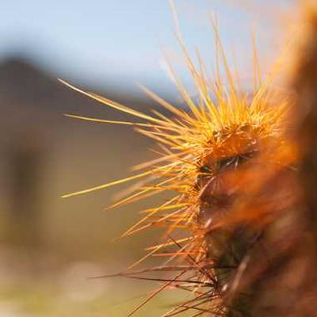
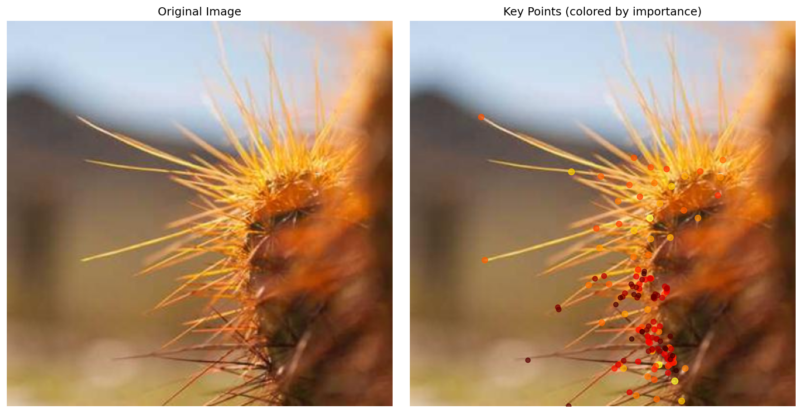

# Portrait One-Line Drawing Experiment

## Overview

This experiment tests the DrawAI tool's ability to convert a photographic portrait into artistic one-line drawings using different styles.

## Input Image

**Source**: Random portrait from [Lorem Picsum](https://picsum.photos/400/400)  
**Dimensions**: 400x400 pixels  
**Format**: JPEG

## Analysis Results

The AI identified **144 key points** through:
- Edge detection and contour extraction
- Saliency mapping to identify visually important regions  
- Corner detection for structural features

*Red dots show key points colored by importance - brighter/larger dots indicate higher visual significance*

## Generated One-Line Drawings

### Smooth Style
**Algorithm**: Spline interpolation with subtle artistic variation  
**Characteristics**: Clean curves, minimal squiggles, elegant flow

### Sketchy Style  
**Algorithm**: Enhanced squiggle generation with controlled randomness  
**Characteristics**: Hand-drawn appearance, organic variation, artistic imperfection

### Minimal Style
**Algorithm**: Simplified spline curves focusing on essential features  
**Characteristics**: Clean lines, reduced detail, geometric precision

## Technical Details

| Metric | Value |
|--------|--------|
| Key Points Extracted | 144 |
| Path Planning Method | Genetic Algorithm |
| Processing Time | ~3-5 seconds |
| Output Format | SVG (scalable vector graphics) |

### File Sizes
- **Smooth**: 26.6 KB (12,326 coordinate points)
- **Sketchy**: 19.6 KB (9,059 coordinate points) 
- **Minimal**: 16.0 KB (7,372 coordinate points)

## Path Optimization

The genetic algorithm successfully:
1. Found a continuous path through all 144 key points
2. Balanced drawing efficiency with artistic appeal
3. Maintained single-stroke constraint throughout
4. Preserved recognizable features of the original portrait

## Observations

- **Feature Recognition**: Successfully identified facial features, hair contours, and clothing edges
- **Artistic Quality**: Each style produces distinctly different aesthetic while maintaining subject recognizability
- **Path Continuity**: All drawings maintain perfect single-line continuity
- **Scalability**: SVG output allows infinite scaling without quality loss

## Conclusion

The experiment demonstrates DrawAI's capability to transform photographic portraits into artistic one-line drawings that capture essential visual characteristics while providing multiple stylistic interpretations.