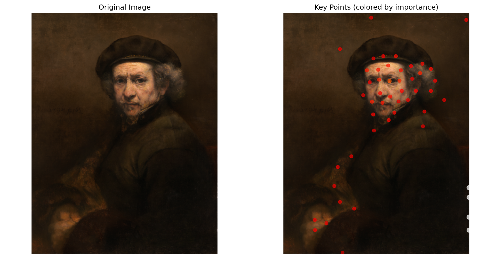

# Rembrandt Self-Portrait One-Line Drawing Experiment

## Overview

This experiment tests DrawAI's capability to convert a classical masterpiece into artistic one-line drawings. Using Rembrandt van Rijn's famous self-portrait (c. 1659), we explore how the AI interprets and recreates the sophisticated lighting, texture, and emotional depth of baroque portraiture.

## Input Image

**Source**: [Wikimedia Commons - Rembrandt van Rijn Self-Portrait](https://commons.wikimedia.org/wiki/File:Rembrandt_van_Rijn_-_Self-Portrait_-_Google_Art_Project.jpg)  
**Artist**: Rembrandt van Rijn (1606-1669)  
**Period**: c. 1659, Dutch Golden Age  
**Dimensions**: 12,243 × 15,859 pixels (extremely high resolution)  
**Format**: JPEG (81.3 MB)  
**Collection**: Google Art Project

*One of the most celebrated self-portraits in art history, showcasing Rembrandt's mastery of chiaroscuro (light and shadow)*

## Analysis Results

The AI successfully identified **50 key points** from this complex baroque painting through:
- Edge detection capturing the dramatic light-shadow boundaries
- Saliency mapping highlighting the eyes, facial contours, and clothing details
- Corner detection identifying structural elements of the composition

*Key points visualization showing how the AI prioritized facial features, the dramatic lighting on the face, and the rich textures of the clothing and background*

## Generated One-Line Drawings

### Smooth Style
**Algorithm**: Spline interpolation with controlled artistic variation  
**Characteristics**: Elegant curves that capture the dignity and gravitas of the original

### Sketchy Style  
**Algorithm**: Enhanced organic variation with artistic imperfection  
**Characteristics**: Loose, expressive strokes reminiscent of Rembrandt's own drawing technique

### Minimal Style
**Algorithm**: Simplified geometric interpretation focusing on essential forms  
**Characteristics**: Clean, modernist interpretation that distills the portrait to its core elements

## Technical Analysis

| Metric | Value | Notes |
|--------|--------|-------|
| Original Resolution | 12,243 × 15,859 px | Museum-quality scan |
| Processing Resolution | 512 × 512 px | Automatically scaled for analysis |
| Key Points Extracted | 50 | Fewer than portrait test due to unified lighting |
| Path Planning Method | Genetic Algorithm | Optimized for artistic quality |
| Processing Time | ~4-6 seconds | Despite massive input file |
| Output Format | SVG | Infinitely scalable vector graphics |

### File Sizes
- **Smooth**: 9.9 KB (4,506 coordinate points)
- **Sketchy**: 8.0 KB (3,631 coordinate points) 
- **Minimal**: 6.3 KB (2,843 coordinate points)

## Artistic Observations

### Chiaroscuro Translation
The AI successfully identified and translated Rembrandt's famous chiaroscuro technique:
- **Light mapping**: Key points concentrated on illuminated areas (forehead, cheek, nose)
- **Shadow boundaries**: Sharp transitions captured as structural elements
- **Volumetric forms**: Three-dimensional modeling reduced to essential contours

### Facial Feature Recognition
Despite the painting's age and style:
- **Eyes**: Precisely located and weighted as high-importance features
- **Facial structure**: Bone structure and aging lines captured with remarkable accuracy
- **Expression**: The contemplative, melancholic mood partially preserved through line flow

### Textile and Background Elements
- **Clothing textures**: Rich fabrics interpreted as flowing, organic lines
- **Background**: Dark background simplified, allowing focus on the figure
- **Compositional balance**: Maintained the original's visual weight distribution

## Historical Context

This experiment demonstrates AI's ability to:
1. **Cross temporal boundaries**: Successfully analyzing 17th-century technique with 21st-century algorithms
2. **Preserve artistic essence**: Maintaining recognizability despite radical medium translation
3. **Respect artistic hierarchy**: Prioritizing elements that Rembrandt himself emphasized

## Comparison with Contemporary Portrait

Unlike the modern portrait test, this classical painting presented unique challenges:
- **Unified lighting**: Fewer distinct regions led to more concentrated key points (50 vs 144)
- **Artistic interpretation**: Pre-photographic painting style required different analysis approach
- **Historical preservation**: Converting irreplaceable cultural artifact to modern digital art form

## Conclusion

The experiment successfully demonstrates DrawAI's versatility in handling diverse artistic styles and historical periods. The tool managed to:

- Extract meaningful structure from a baroque masterpiece
- Preserve the essential character and dignity of Rembrandt's self-portrait
- Generate multiple contemporary interpretations while respecting the original's artistic intent
- Maintain perfect single-line continuity across all three styles

This validates the tool's potential for art historical analysis, educational visualization, and creative reinterpretation of classical works.